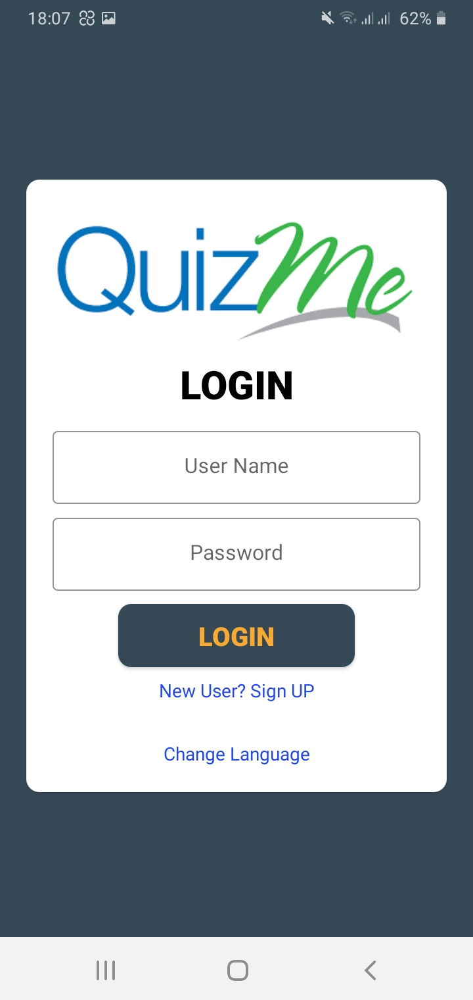
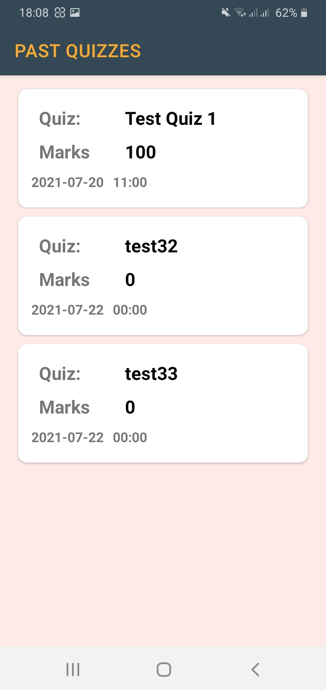
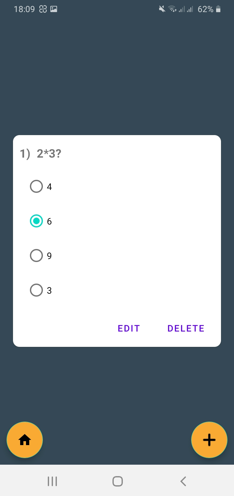

<html>
<head>
<h1>QUIZ ME</h1>
</head>
<body>
  <h2>What is this repository for?</h2>
<ul>
  <li>This repository is for QUIZ ME android application.</li>
  <li>System Requiremnts: - Java 11, Android Studio</li>
  <li>Version 2.1</li>
</ul>

  

 
<h2>How do I get set up?</h2>
<ul>
  <li>Clone or Download the repository</li>
  <li>open the project using android studio</li>
  <li>Build and Run the project</li>
</ul> 
  <table style="width:100%">
  <tr>
    <th></th>
    <th></th> 
    <th></th>
    <th></th>
   </tr>
     <tr>
    <th></th>
    <th></th> 
    <th></th>
    <th></th>
   </tr>
     <tr>
    <th></th>
    <th></th> 
    <th></th>
    <th></th>
   </tr>
     <tr>
    <th></th>
    <th></th> 
    <th></th>
    <th></th>
   </tr>
     <tr>
    <th></th>
    <th></th> 
    <th></th>
    <th></th>
   </tr>
     <tr>
    <th></th>
    <th></th> 
    <th></th>
    <th></th> 
   </tr>
</table>
<h2>Features</h2>

Quiz Me is an online Mobile Application that allows you to, make your online mock test, set multiple choice questions & share with ease.

QuizME is an online class quiz maker application that allows you to create, publish and share quizzes or exams. Tutors can
create their quizzes and share them with the students and evaluate them. Even anyone can use it for self-evaluation or entertainment purposes and also scheduled manner.

QuizMe can be used by educators, trainers, non-profits, businesses, and other professionals who need an easy way to quickly make exams, tests, and quizzes online. You can create and publish your first exam in a few minutes!

Start using the best and most powerful quiz creator QuizME app now. The free plan includes all the cool features such as:
  
<ul>
  <li>Create Quiz</li>
  <li>Add Questions</li>
  <li>Edit Questions</li>
  <li>Delete Questions</li>
  <li>Join Quizzes</li>
  <li>Review Answer Sheet</li>
  <li>Set Timer</li>
  <li>Instant leaderboard</li>
  <li>Get revisions of the past quizzes</li>
  <li>Collects data remotely</li>
  <li>Sinhala Language Support</li>
  <li>Receive newest Updates</li>
</ul>

Now Let's see more details about QUIZ ME Features
  
<ol>
  <li>Create online quizzes easily
    

      You can easily start to create a new quiz using create quiz option in the quiz fragment. You may give details of the quiz, date, time, and time limit. After that, you can easily create new questions and add them to the list. After adding all the questions, you can finish it and you will get the quiz ID that will need to share with others.
    

  </li>
  <li>Edit schedule date, time, and questions easily
    

     Don’t worry if you just forget to add some questions or if you need to change the scheduled date or time. You can easily change the quiz schedule anytime you want. Not only that but also you can add more questions, edit or delete existing questions.
    

  </li>
  <li>Publish quizzes and exams
    

     You can publish your quiz any time before the scheduled time. You can access your scheduled quiz list and copy the quiz ID from there and share it with others (who need to join the quiz).
    

  </li>
  <li>Join and do the quiz or exam
    

      Are you worrying about join and do the quiz from the same app? No, you don’t have to. This app will provide that feature as well. You can easily join a quiz just by entering the quiz ID if the quiz started only. After joining the quiz timer starts and you will need to provide answers before the given time. If you failed to submit it before the time ends, will get the 0? No.., it will automatically submit the answers you have given so far.
    

  </li>
  <li>Check test results and calculate marks instantly
    

      QuizME allows checking student's scores instantly after the quiz is finished. Not only that but also, he/she can access quizzes that he/she joined before and check the scores and the answers descriptions.
    

  </li>
  <li>Leaderboard
    

      You can easily get the feedback of the result sheet of all the participants who had joined to quizzes that you have hosted using the leaderboard option.
    

  </li>
</ol>
<ul>
<li>Instructions also are there.</li>
<ul>
<li>How to add a Quiz?</li>
<li>How to see created Quizzes?</li>
<li>Can I edit the Created Quiz problems?</li>
<li>I am a Quiz Participant. How to Get the Quiz Id?</li>
<li>How to Join a Quiz?</li>
<li>I am a Quiz Participant. Can I see my Quiz Results?</li>
<li>How to see the Leaderboard of a created Quiz?</li>
<li>How to see marks of my past attended Quizzes?</li>
<li>Privacy</li>
<li>Do you like Our App?</li>
<li>What can I do if I see something unusual happening in the App?</li>
</ul>
<li>finally We have included the privacy policy of the application.</li>
</ul>
</ul>
<h2>Sinhala Language Support</h2>
  
This is one of the coolest features in QUIZ ME mobile app.
  
  <table style="width:100%">
  <tr>
    <th>
    <th> 
    <th>
    <th>
    </tr>
</table>
<h2>Receive newest Updates</h2>

If there is a Update and the curent version in User's App doesn't work with newest Update , user will get notified it in Quiz Me Home Page.

  

 
 
By clicking "Update", User will redirect to Quiz Me Google Playstore page.

<h2>Tested Devices</h2>
<ul>
  <li>Samsung Galaxy M10 [os-Q]</li>
  <li>Oppo A5 2020 [os-Oreo]</li>
  <li>Huawei GR5 mini [os-Nougat]</li>
  <li>Samsung Galaxy J7 Nxt [os-Nougat]</li>
  <li>Samsung Galaxy J7 [os-Marshmallow]</li>
  <li>Samsung Galaxy Grand prime [os-lollipop]</li>
  
Apk file was added - <a href="https://github.com/Team-nanocode/Quiz-me/tree/main/apk">view APK</a> 

</ul>
<h2>Contact Details</h2>
<ul>
  <li>Contributer:Nuwan Harsha        (nuwan.harshamatrix@gmail.com)</li>
  <li>Contributer:Erandana Wijerathne (erandanawijerathne96@gmail.com)</li>
  <li>Contributer:Saubhagya Munasinghe(sm201211d@gmail.com)</li>
  <li>Contributer:Maneesha Randeniya  (randeniyamaneesha13@gmail.com)</li>
  <li>Contributer:Nipun Dewanarayana  (ncdsomarathne@yahoo.com)</li>
</ul>
<h2>How to Contribute</h2>
<ul>
  <li>Please report issues at <a href="https://github.com/Team-nanocode/Quiz-me/issues">GitHub Issue Tracker</a>.</li>
  <li>Send your contributions as pull requests to <a href="https://github.com/Team-nanocode/Quiz-me/tree/main">main branch</a>.</li>
</ul>
  
<h2>Licence</h2>
  <li>This project is maintained under the MIT licence.</li>
</body>
</html>
